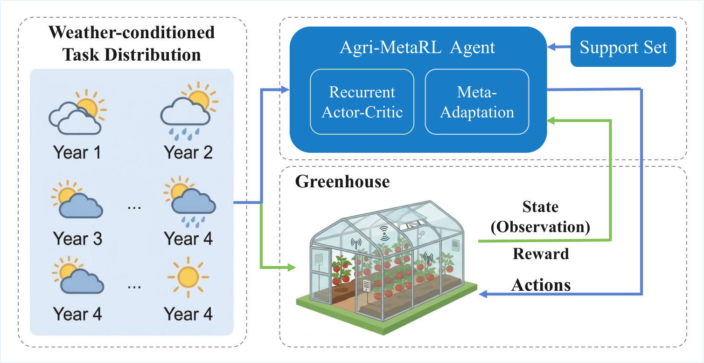

# Agri-MetaRL

Agricultural Meta-Reinforcement Learning for Greenhouse Climate Control

Agri-MetaRL is a meta-reinforcement learning algorithm that improves advantage estimation for greenhouse climate control. It introduces **MetaAdvantageHead** on Recurrent PPO, performing task-adaptive advantage correction through support-query partitioning. Experiments show that Agri-MetaRL achieves higher training return and EPI than PPO and Recurrent PPO baselines.

<p align="center">
  
</p>

## Table of Contents

- [Summary](#summary)
- [Installation](#installation)
- [Repository Structure](#repository-structure)
- [Paper Figures](#paper-figures)
- [Usage](#usage)
- [Citation](#citation)

## Summary

### Key Features

- **Task-distribution modeling**: Greenhouse control is formulated as a set of related tasks defined by weather year, start date, and scenario conditions.
- **MetaAdvantageHead**: A custom module that encodes task context from support trajectories and performs task-adaptive correction on query trajectories.
- **Lightweight design**: No extra policy branches or heavy bi-level optimizers; compatible with standard Recurrent PPO training flow.
- **Evaluation protocol**: Unified protocol with training-distribution and held-out-distribution testing.

### Main Results

- Final mean training return: **3955** (vs Recurrent PPO 3886, PPO 3811)
- Highest EPI: **3.46 €/m²** under the fixed protocol
- Lowest violation steps for temperature, humidity, and CO₂

## Installation

### Requirements

- Python >= 3.10 (tested on 3.11)
- Greenhouse simulation environment (compatible with standard gym interfaces)
- Stable-Baselines3, sb3-contrib, PyTorch

### Steps

1. **Clone the repository**

   ```bash
   git clone https://github.com/1240945123/Agri-MetaRL.git
   cd Agri-MetaRL
   ```

2. **Create a virtual environment**

   ```bash
   conda create -n agri_metarl python=3.11
   conda activate agri_metarl
   ```

3. **Install dependencies**

   ```bash
   pip install -e .
   pip install stable-baselines3 sb3-contrib torch
   ```

## Repository Structure

| Folder | Description |
|--------|-------------|
| [`gl_gym/RL/agri_metarl/`](./gl_gym/RL/agri_metarl/) | Agri-MetaRL implementation: MetaAdvantageHead, buffer, training logic |
| [`gl_gym/configs/agents/`](./gl_gym/configs/agents/) | Agent configs including `agri_metarl.yml` |
| [`run_scripts/`](./run_scripts/) | Training and evaluation scripts |
| [`visualisations/`](./visualisations/) | Plotting scripts for paper figures |
| [`visual/`](./visual/) | Paper figures (Figure_1–5.pdf) |

## Paper Figures

- [Figure 1](visual/Figure_1.pdf)
- [Figure 2](visual/Figure_2.pdf)
- [Figure 3](visual/Figure_3.pdf)
- [Figure 4](visual/Figure_4.pdf)
- [Figure 5](visual/Figure_5.pdf)

## Usage

### 1. Training

Train PPO, Recurrent PPO, and Agri-MetaRL:

```bash
python run_scripts/train_paper_experiments.py --device cpu
```

### 2. Evaluation Pipeline

Run the full paper pipeline (fixed protocol, generalization, figures):

```bash
python run_scripts/run_paper_pipeline_after_train.py --skip-train
```

(Use `--skip-train` if models are already trained.)

### 3. Generate Paper Figures

```bash
python visualisations/plot_paper_figures.py
```

Outputs: visual/Figure_1.pdf–Figure_5.pdf

### 4. Record 60d Trajectory

```bash
python run_scripts/record_trajectory_60d.py --algorithm agri_metarl
```

## Citation

If you use Agri-MetaRL in your research, please cite:

```bibtex
@article{huang2025agrimetarl,
  title={Agri-MetaRL: An Agricultural Meta-Reinforcement Learning Algorithm for Greenhouse Climate Control},
  author={Huang, Qiang and Xie, Tianchen and Yu, Chengkai and Ma, Zhaoxiong},
  journal={Knowledge-Based Systems},
  year={2025},
  note={Submitted}
}
```

## Data Availability

The source code and evaluation pipeline are available at [https://github.com/1240945123/Agri-MetaRL](https://github.com/1240945123/Agri-MetaRL).

## Authors

- **Qiang Huang** (黄强), **Tianchen Xie** (谢添臣) — College of Information Engineering, Sichuan Agricultural University
- Chengkai Yu (喻成凯), Zhaoxiong Ma (马照雄)

## License

See [LICENSE](./LICENSE).
